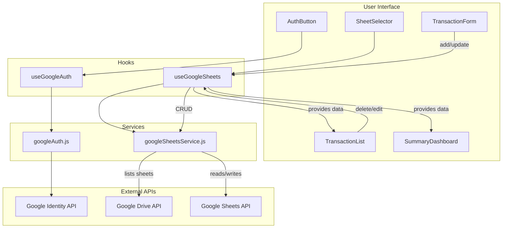

# Architecture

This document outlines the architecture of the Personal Finance Tracker application.

## Overview

The application is a single-page application (SPA) built with React. It uses Google Sheets as a backend for data storage and Google for authentication. This serverless approach simplifies deployment and leverages the user's existing Google account for a seamless experience.

## Technology Stack

- **Frontend:**
  - [React](https://reactjs.org/) (with Vite for development)
  - [Tailwind CSS](https://tailwindcss.com/) for styling
- **Backend & Data:**
  - [Google Sheets API](https://developers.google.com/sheets/api) for data storage.
  - [Google Drive API](https://developers.google.com/drive/api) to list available spreadsheets.
- **Authentication:**
  - [Google Identity Services](https://developers.google.com/identity) for user authentication (OAuth 2.0).

## Architecture Diagram

The following diagram illustrates the flow of data and interactions between the components of the application.

## Data Flow and Component Interaction

### 1. Authentication

1.  The user visits the application. The `App` component uses the `useGoogleAuth` hook to check the user's sign-in status.
2.  If the user is not signed in, they are prompted to log in. The `AuthButton` component triggers the `signIn` function from the `useGoogleAuth` hook.
3.  The `useGoogleAuth` hook calls the `googleAuth.js` service, which interacts with the Google Identity API to handle the OAuth 2.0 flow.
4.  Once authenticated, the user's profile information and access token are stored in the application's state.

### 2. Selecting a Sheet

1.  After signing in, the `SheetSelector` component fetches a list of available "Monthly budget" spreadsheets from the user's Google Drive.
2.  It uses the `useSheetsList` hook (part of `useGoogleSheets.js`), which calls the `listMonthlySheets` function in the `googleSheetsService.js`.
3.  This service makes a request to the Google Drive API to find the relevant files.
4.  The user selects a sheet from the dropdown, and its ID is stored in the `App` component's state.

### 3. Viewing Data

1.  When a sheet is selected, the `useGoogleSheets` hook is activated with the `spreadsheetId`.
2.  The hook calls `getTransactions` and `getSummary` from the `googleSheetsService.js`.
3.  The service makes requests to the Google Sheets API to fetch the data from the "Transactions" and "Summary" sheets within the selected spreadsheet.
4.  The fetched data (transactions and summary) is passed down to the `TransactionList` and `SummaryDashboard` components for rendering.

### 4. Modifying Data (CRUD Operations)

-   **Create:** The user fills out the `TransactionForm` and submits it. This calls the `handleAddTransaction` function in the `useGoogleSheets` hook, which in turn calls the `addTransaction` function in the `googleSheetsService.js` to append a new row to the "Transactions" sheet.
-   **Update:** When the user edits a transaction, the `TransactionForm` is pre-filled. Submitting it calls `handleUpdateTransaction`, which uses the `updateTransaction` service function to update the specific row in the sheet.
-   **Delete:** Clicking the delete button on a `TransactionItem` calls `handleDeleteTransaction`, which uses the `deleteTransaction` service function to remove the corresponding row from the sheet.

After each CRUD operation, the `useGoogleSheets` hook re-fetches the data to ensure the UI is up-to-date.

## Project Structure

The `src` directory is organized as follows:

-   `components/`: Contains the React components, categorized by feature (auth, dashboard, sheets, transactions).
-   `hooks/`: Contains the custom hooks that manage the application's state and side effects, separating the business logic from the UI.
-   `services/`: Contains modules that interact with external APIs (Google Auth and Google Sheets). This layer abstracts the API calls from the rest of the application.
-   `config/`: Configuration files, such as transaction categories.
-   `utils/`: Utility functions for formatting, validation, etc.
-   `App.jsx`: The main application component that assembles the UI.
-   `main.jsx`: The entry point of the application.
